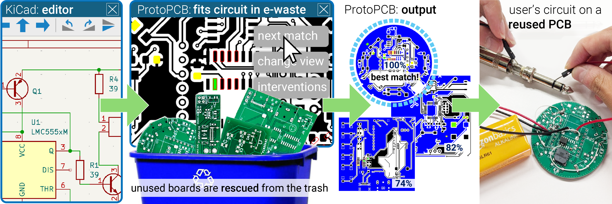

# ProtoPCB

This repository contains our tests, evaluation files, and software tool (ProtoPCB) presented in the paper "ProtoPCB: Reclaiming Printed Circuit Board E-waste as Prototyping Material", which will appear at CHI2025. This tool was built by Jasmine Lu (@xjasminelu), Sai Rishitha Boddu (@rishiboddu) with project assistance from Pedro Lopes at the University of Chicago's [Human Computer Integration Lab](https://lab.plopes.org).

## ProtoPCB Software 
ProtoPCB is a python-based tool that builds off of [KiCad](https://www.kicad.org/) command line tools, [Tkinter](https://docs.python.org/3/library/tkinter.html), [OpenCV](https://opencv.org/), [CairoSVG](https://cairosvg.org/), and [pcb-tools](https://github.com/curtacircuitos/pcb-tools). It is designed to support analyzing PCB Boards to identify ways they can be reused to implement new circuits. It does so by taking an input schematic and using computer vision to scan boards for their solder pads, conducting traces, and vias in order to map out the relevant connections of the board. Using this mapping, it analyzes all the methods that can be used to implement a circuit (positions to place a component, wires to add, traces to cut, etc.).

### Features Overview

*PCB Board representation*

*Component representation*

*Net representation*

*Circuit representation*

*Component matching*

*Net matching*

*Circuit matching*

*GUI*

*Camera Image to ProtoPCB Input*

*Test Suite*

## Repository Organization
### Code
Code is organized in the code directory. This includes ProtoPCB's base code (scripts, GUI, test suite). You can use this to run technical evaluations (via scripts in tests.py).

### Evaluation Files
All files and data for the Technical Evaluation (PCB boards) can be found in the [Evaluation Files](./Evaluation Files) directory

### Installation
To use ProtoPCB, you must have installed KiCad and Python3 on your machine. The system was built primarily with Mac OS. It has not been tested yet on Windows so some elements may not port over well. If you're interested in collaborating on a Windows version, please reach out!

Detailed instructions can be found on the page [INSTALL.md](./INSTALL.md)

## Contributing
### Submitting issues
As this tool was born out of a research project, it is a _prototype_. However, we'd love to hear about any bugs you might encounter during use of our tool. We encourage you to submit any issues that arise and we'll do our best to get around to them. Please note that there is only one (very busy) PhD student who will be able to provide support, so please extend us grace with any issues you encounter!

### How to contribute
(adapted from [Clipy](https://github.com/Clipy/Clipy))
1. Fork it ( https://github.com/humancomputerintegration/ProtoPCB/fork )
2. Create your feature branch (`git checkout -b my-new-feature`)
3. Commit your changes (`git commit -am 'Add some feature'`)
4. Push to the branch (`git push origin my-new-feature`)
5. Create a new Pull Request

### License & Citation
ProtoPCB is released under the [GNU GPL V3](./Software_License.txt). We would love to have you build off our work! Please reach out if we can be helpful in that.

When using or building upon this work in an academic publication, please consider citing as follows:

Jasmine Lu, Sai Rishitha Boddu, and Pedro Lopes. 2025. ProtoPCB: Reclaiming Printed Circuit Board E-waste as Prototyping Material. In Proceedings of the CHI Conference on Human Factors in Computing Systems 2025 (CHI’2025). Association for Computing Machinery, New York, NY, USA. https://doi.org/10.1145/3586183.3606745

### Contact
For questions or if something is wrong with this repository, contact jasminelu@uchicago.edu

